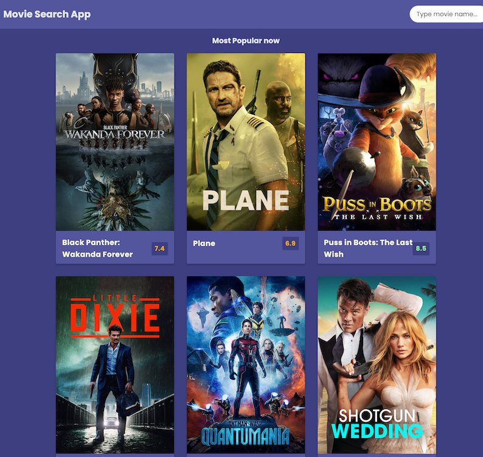

## Topics Covered

Movie Search App built using Redux-toolkit for global state management and Redux-Saga as a middleware for async API calls. With the help of React(Vite) and The Movie Database(TMDB) API.

## UI Screenshot

## Topics Covered

- Redux Toolkit and Redux-Saga
- React Components, Props
- React Hooks: useState and useEffect
- Child-to-Parent and Parent-to-Child communication using props
- Lifting State Up
- JS Modules
- JS Higher Order Function: Map
- CSS Flex Box

## Create account with TheMovieDB

1. Sign up at https://www.themoviedb.org/signup

2. Go to : Account > Settings > API

3. Generate API Key (v3 auth) and copy it.

4. Open "store/saga/movieSaga.jsx" file and find these 2 variables : API_URL and SEARCH_API

5. And replace _YOUR API KEY_ parts with you own API key.

## Available Scripts

1. Install all needed NPM packages by typing: `npm install` in your terminal.

2. Now Run: `npm run dev` to start app in your local server.
